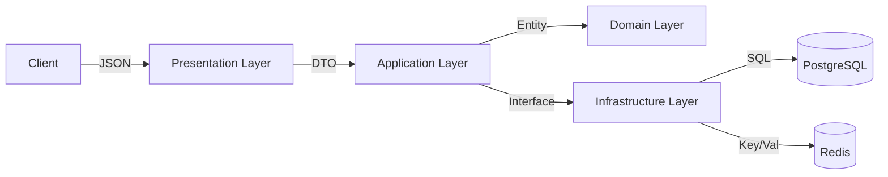
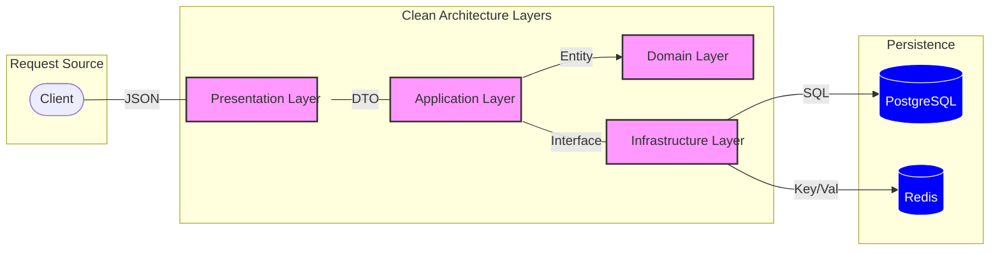

# 🚀 Go-Auth-System: Production-Grade DDD Template

A high-performance **Authentication & User Management** system built with **Golang**. This project serves as a reference for implementing **Domain-Driven Design (DDD)** and **Clean Architecture** with a focus on security, scalability, and cloud readiness.

---

## 🛠 1. Tech Stack

| Category | Technology | Purpose |
| :--- | :--- | :--- |
| **Runtime** | **Go 1.23+** | High-concurrency backend engine |
| **Primary DB** | **PostgreSQL 16** | Relational data persistence |
| **Cache/Session** | **Redis 7** | Stateful Token Management (Refresh/Reset) |
| **Persistence** | **SQLC & pgx** | Type-safe, high-performance SQL generation |
| **API Layer** | **Chi Router** | Standard-compliant, lightweight routing |
| **Auth** | **JWT & Argon2** | Stateless tokens & military-grade hashing |
| **Ops** | **Docker & Make** | Containerization and task automation |

---

## 🏗 2. System Architecture

This project follows **Clean Architecture** to ensure the business logic remains decoupled from the infrastructure.

### Request Flow



---

## 📂 3. Project Structure

The codebase is organized into isolated layers to prevent technical debt and allow easy scalability:

```text
.
├── api/                   # OpenAPI/Swagger docs & definitions
├── cmd/api/               # Application entry point (main.go)
├── db/migration/          # Database versioning (SQL migration files)
├── internal/              # Private application code
│   ├── app/               # Bootstrap logic (db.go, router.go)
│   ├── auth/              # Authentication Module (DDD Context)
│   │   ├── app/           # Application Layer (service.go)
│   │   ├── delivery/      # Presentation Layer (handler, request, response)
│   │   ├── domain/        # Domain Layer (repository interfaces)
│   │   └── infra/         # Infrastructure Layer (repo implementation)
│   ├── db/sqlc/           # Auto-generated SQLC code
│   ├── middleware/        # Custom Middlewares (auth, tracing)
│   ├── pkg/               # Shared utilities (rest, validator)
│   └── util/              # Common helpers (config, token, password)
├── sqlc/                  # SQL query definitions for SQLC
├── Makefile               # Automation commands
└── sqlc.yaml              # SQLC configuration
```
---

## 📋 4. Prerequisites

Before you start, ensure you have the following installed:
* **Languages**: `Go 1.23+`
* **Containers**: `Docker` & `Docker Compose`
* **CLI Tools**:
    * **SQLC**: `go install github.com/sqlc-dev/sqlc/cmd/sqlc@latest`
    * **Swag**: `go install github.com/swaggo/swag/cmd/swag@latest`
    * **Migrate**: `go install -tags 'postgres' github.com/golang-migrate/migrate/v4/cmd/migrate@latest`

---

## 🚀 5. Run Guide

### Step 1: Initialize Environment
Copy the example environment file and configure your local variables to match your infrastructure:
```bash
cp .env.example .env
```

Note:
For Localhost execution, ensure ```POSTGRES_HOST=localhost```. When running the full stack in Docker, use ```POSTGRES_HOST=db```

### Step 2: 
Choose Your Environment:
| Environment | Command | Description |
| :--- | :--- | :--- |
| **Localhost** | `docker-compose up -d db redis` <br> `make dev` | Native execution on your OS. Docker is used only for Database and Redis. |
| **Dev (Docker)** | `docker-compose up --build` | Runs the entire stack (API, DB, Redis) inside Docker with **Hot-Reload** enabled. |
| **Staging/Prod** | `docker-compose -f docker-compose.yaml -f docker-compose.prod.yaml up -d` | Uses **Multi-stage builds** for a minimal production image without source code. |

### Step 3: 
Verify Installation:
Once the server has started, verify the deployment through these endpoints:
* **Health Check**: `http://localhost:8080/health`
* **Swagger Documentation**: `http://localhost:8080/swagger/index.html`

migrate create -ext sql -dir db/migration -seq init_schema
